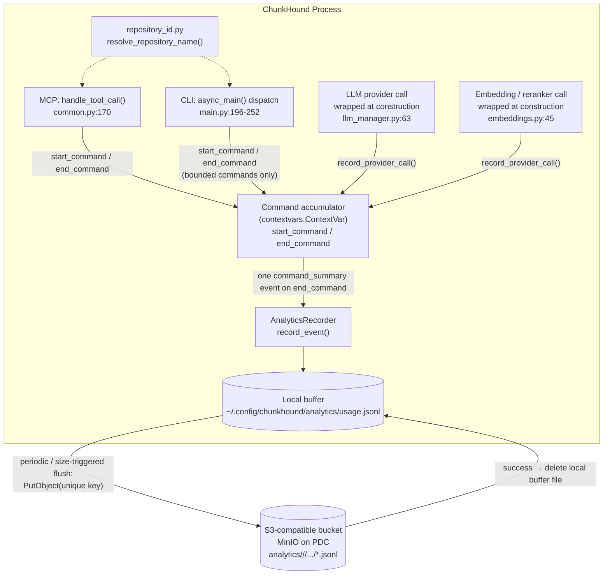
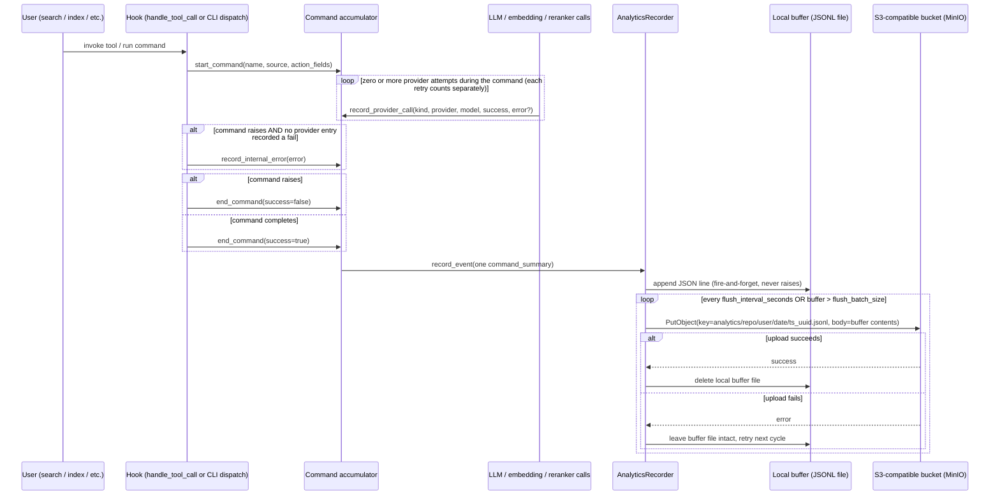

# ChunkHound Per-User Analytics — Design Proposal

**ALGINF-5738** | Epic: ALGINF-5393 (GenAI & ChunkHound Developments — Q4_2026) | Generated: 2026-08-27 (rev. 6 — per-vendor call/error metrics) | Status: Pending Approval

## Contents

- [Context](#context)
- [Key Design Decisions](#key-design-decisions)
- [Architecture & Flow](#architecture--flow)
- [Architecture Detail](#architecture-detail)
- [Concurrency & Collision Prevention](#concurrency--collision-prevention)
- [Privacy](#privacy)
- [Hook Points (MCP + CLI)](#hook-points-mcp--cli)
- [Data Model](#data-model)
- [Configuration](#configuration)
- [Non-Goals](#non-goals)
- [Authorization & Trust Model](#authorization--trust-model)
- [Testing](#testing)
- [Verification](#verification)

---

## Context

[ALGINF-5738](https://pdc-amat-prod.atlassian.net/browse/ALGINF-5738) ("ChunkHound Per-User Analytics", requested by Nir S.) asks for visibility into who uses ChunkHound, how much, and what it costs per user — specifically: per-user counts of MCP tool usage by type, plus requests made to LLM, embedding, and reranker providers.

The ticket itself leaves two questions explicitly open: *"How to identify user?"* and *"Where do we store the data?"* It also names a prerequisite, **ALGINF-5804** ("ChunkHound Configuration Auto-Update"), needed for org-wide rollout — that ticket is still TBD/unscoped, so this design does **not** block on it. Analytics is treated as manually opt-in for now and can be flipped on centrally later once ALGINF-5804 exists.

**Revision history:** rev. 1 defined five separate event types (`tool_call`, `llm_request`, `embedding_request`, `reranker_request`, `indexing_run`) POSTed to a to-be-built central server. Rev. 2 replaced the transport with direct client-to-S3 uploads (self-hosted MinIO on PDC), removing the ingestion server entirely. Rev. 3 unified the data model itself: every MCP tool call and CLI command now emits exactly **one** `command_summary` event — describing the action taken, a rollup of every LLM/embedding/reranker call made underneath it, and an error summary — rather than several separate events per invocation. The store-and-forward buffering/upload mechanics from rev. 2 are unchanged; only what gets buffered changed. Rev. 4 added no architecture changes — it responded to review feedback by making the current Phase 1 authorization/trust assumptions explicit (previously only implicit in the S3/MinIO transport decision) and documented a proposed, out-of-scope Phase 2 direction for closing the gap. **Rev. 5, following a second round of review, fixes a real gap that predated rev. 4** — the object key's identity segment had always been the raw OS username regardless of `privacy_mode`, undermining the `hashed`/`anonymous` tiers — hardens the Phase 1 write-up (reader/reporting credential boundary, TLS, secret rotation, sensitivity framing), adds a "Relationship to provider API tokens" subsection, and re-ranks the Phase 2 options (per-developer static credentials as an incremental step, the presigned-URL broker as the longer-term target with broker-bound identity now a stated requirement). See [Authorization & Trust Model](#authorization--trust-model). **Rev. 6 (this revision)** answers a new requirement — visibility into vendor call volume and failure rates, broken down per vendor — by moving failure accounting from a flat, command-level `errors: {count, types}` block into a per-`(kind, provider, model)` breakdown (`fails`, `error_types`) alongside the existing `calls`/token rollup, with a narrow `internal_error_type` fallback for the rare failure not caused by any vendor call. See [Data Model](#data-model) and [Architecture Detail](#architecture-detail).

This proposal defines a client-side, **store-and-forward** analytics pipeline: buffer usage events locally, periodically flush the buffer as a single, uniquely-named object directly to an S3 bucket, and clear the local buffer on successful upload. Cost-in-dollars conversion is explicitly out of scope — this ships only the ChunkHound-side instrumentation and upload logic.

---

## Key Design Decisions

- **Unified event model** `revised (rev. 3)` — one `command_summary` event per MCP tool call or bounded CLI command, replacing the five separate event types from rev. 1/2 (including the special-cased `indexing_run`, which is now just the `index` command using the same general mechanism). Rationale: the same "flood of events" problem that motivated the original indexing rollup applies to every command, not just indexing — generalizing the pattern avoids re-solving it per-command and gives a consistent event shape everywhere.
- **Action description** `added` — each command/tool defines its own small set of summary fields (e.g. `search` → `query`; `code_research` → `question`; `fetchurl` → `url`; `index` → `mode` + `file_count` + `total_chunks`) rather than a generic dump of all arguments — keeps events meaningful and avoids leaking oversized/irrelevant argument values.
- **Provider rollup** `revised (rev. 6)` — LLM/embedding/reranker activity during a command is summarized as counts and token totals **broken down by provider + model** (not just a flat total), preserving the earlier cost-varies-by-model decision from rev. 1. As of rev. 6, `calls` counts every attempt (success + fail), not just successes.
- **Per-vendor failure attribution** `revised (rev. 6)` — rev. 3's command-level `errors: {count, types}` couldn't tell you *which* vendor call failed. Each `providers[kind]` entry now carries its own `fails` (subset of `calls`) and `error_types` (`{ExceptionTypeName: count}`) — type name only, never message text, same rationale as before. The old top-level `errors` block is removed; a single `internal_error_type` fallback (also type-name-only) covers the rare failure not caused by any vendor call. See [Data Model](#data-model) and [Architecture Detail](#architecture-detail).
- **User identity & privacy modes** `added` — OS username remains the default (`privacy_mode = "full"`, unchanged for existing adopters). Two additional configurable tiers were added for organizations strict about personal-data collection: `hashed` (salted one-way hash) and `anonymous` (`user` field present but `null`). See [Privacy](#privacy) below.
- **Systematic non-identifying fields** `added` — every event also carries `os` (`platform.system()`) and `chunkhound_version` (`chunkhound.__version__`), regardless of `privacy_mode` — not personally identifying, and they partially compensate for the cross-machine correlation lost in `hashed` mode.
- **Data destination** `decided (rev. 2)` — local JSONL buffer file → periodic/event-based flush → the entire buffer file is uploaded as one new, uniquely-named object directly to an S3-compatible bucket (self-hosted MinIO on PDC) → the local buffer is cleared only after a successful upload.
- **Opt-in** `decided` — off by default (`analytics.enabled = false`). Users/teams turn it on manually via config for now; ALGINF-5804 can push this org-wide later without another release.
- **Flush cadence** `decided` — hours-scale by default (not minutes), since per-developer usage is light. Default `flush_interval_seconds = 21600` (6h), with a size-based safety cap (`flush_batch_size = 500` lines), plus a best-effort flush on clean shutdown.
- **Repository attribution** `decided` — every event carries a `repository` field, resolved via `git remote get-url origin` (parsed to repo name), falling back to the directory basename.
- **Object key scheme** `revised (rev. 5)` — `analytics/<repository>/<privacy_id>/<YYYY>/<MM>/<DD>/<iso8601-timestamp>_<uuid4>.jsonl`. As decided in rev. 2, the key's identity segment was always the raw OS username, independent of `privacy_mode` (added in rev. 3) — so `hashed`/`anonymous` mode hid identity in the JSON payload but still leaked it via the S3 path to anyone with list/read access. `<privacy_id>` now reuses the exact value already computed for the payload's `user` field, so the two can never disagree. See [Authorization & Trust Model](#authorization--trust-model) for the full rationale.
- **Client S3 library & credential** `decided (rev. 2)` — `boto3` with a custom `endpoint_url` pointing at the MinIO instance; a single shared, write-only S3 credential distributed via environment variable, kept out of `.chunkhound.json`.
- **Per-process buffer files + atomic rename-before-upload** `added` — a user running ChunkHound against several repositories in parallel has multiple independent OS processes, each with its own `AnalyticsRecorder`. Rather than synchronize concurrent access to one shared file (locking), each process owns a uniquely-named buffer file and never shares it. Flush now atomically renames the active file before reading/uploading it, closing a latent data-loss race in the original design — this was a real bug fix, not just a multi-process accommodation. See [Concurrency & Collision Prevention](#concurrency--collision-prevention) below.

---

## Architecture & Flow

### Component architecture



### Command flow (sequence)



---

## Architecture Detail

### New module: `chunkhound/core/analytics/recorder.py`

An `AnalyticsRecorder` that:

- Owns a buffer file unique to its own OS process (`~/.config/chunkhound/analytics/buffer-<pid>-<process_start_ts>.jsonl` — see [Concurrency](#concurrency--collision-prevention) below), not one fixed shared path.
- Exposes `record_event(event: dict)` — appends a JSON line, fire-and-forget, catches and logs (never raises, never prints to stdout per the MCP-stdio-must-stay-clean rule in `AGENTS.md`).
- Runs a background flush loop: triggers on `flush_interval_seconds` elapsed OR buffered lines exceeding `flush_batch_size`, plus one attempt on shutdown. Atomically renames the active file, uploads the renamed file's contents as one object to S3 via `boto3`'s `put_object`, and deletes it on success; on failure, leaves it in place (retried next cycle without re-renaming).
- Caps the buffer file size (e.g. 10MB) so a long-outage bucket can't fill a user's disk.
- No-ops entirely (no file writes, no background thread) when `analytics.enabled` is false.

### Command accumulator `new in rev. 3`

A `contextvars.ContextVar[CommandAccumulator | None]` holds the "currently open command" — context-var-based (not a single global) so concurrent async MCP tool calls each get an isolated accumulator scoped to their own asyncio task, with no cross-contamination between simultaneous commands' tallies.

- `start_command(command: str, source: "mcp" | "cli", action: dict) -> None` — opens a new accumulator, records the start time, sets it as the current context-var value.
- `record_provider_call(kind: "llm" | "embedding" | "reranker", provider: str, model: str, success: bool, error: Exception | None = None, input_tokens=None, output_tokens=None) -> None` `revised (rev. 6)` — looks up the current accumulator via the context var and updates its per-(kind, provider, model) tallies. Called **once per application-visible attempt** (every retry iteration in an app-level retry loop is its own call; a single LLM chokepoint invocation, whose SDK-internal retries are already resolved by the time it returns/raises, is also its own call — see the Instrumentation Placement table below). `calls` increments on every invocation regardless of `success`; `fails` increments only when `success=False`, alongside `error_types[type(error).__name__]` (`error` required when `success=False`). Token args are only meaningful on success. If no accumulator is open (shouldn't normally happen — every provider call is always triggered by some command), the call is silently dropped rather than raised.
- `record_internal_error(exc: Exception) -> None` `replaces record_error (rev. 6)` — sets the current accumulator's `internal_error_type` to the exception's type name, without capturing message text. Only meaningful when no provider entry has recorded a fail; otherwise a no-op, since a vendor-caused failure already explains the command's outcome.
- `end_command(success: bool) -> None` — finalizes the accumulator (duration = now − start), builds the single `command_summary` event from the tallies + action fields + per-provider fail/error breakdown, calls `record_event()`, then clears the context var. `internal_error_type` on the emitted event is `null` unless `success=False` and every `providers[*][*].fails == 0`.

This generalizes and **replaces** rev. 1/2's special-cased `start_indexing_session()`/`end_indexing_session()` — the `index` CLI command now just calls `start_command("index", "cli", action={...})`/`end_command(...)` like every other command, and per-batch embedding calls during indexing feed the same generic `record_provider_call()` as everywhere else.

### Instrumentation placement per vendor `added (rev. 6)`

There is no single repo-wide chokepoint all three vendor kinds funnel through — each provider class has its own narrow per-attempt call site, and retry visibility differs by vendor kind:

| Vendor | Chokepoint(s) | Retry visibility |
|---|---|---|
| Embedding | `chunkhound/providers/embeddings/openai_provider.py: _embed_batch_internal()`; `chunkhound/providers/embeddings/voyageai_provider.py: _embed_single_batch_locked()` | **App-level.** Each provider wraps its call in its own `for attempt in range(self._retry_attempts)` loop with rate-limit-aware backoff. `record_provider_call` fires once per loop iteration — every attempt, success or fail, is individually visible. |
| Reranker | `openai_provider.py: _rerank_single_batch()`; `voyageai_provider.py: _rerank_via_sdk()` (SDK path) / `_rerank_http_batch()` (HTTP path, no retry at this layer — retries happen one level up via batch-splitting, which does not retry, only splits) | **App-level** for the SDK path, matching embedding. The HTTP path's single-attempt chokepoint still calls `record_provider_call` per attempt; batch-splitting above it is a different concern (chunking work, not retrying a failed attempt) and isn't itself an instrumentation point. |
| LLM | `chunkhound/providers/llm/anthropic_llm_provider.py: _create_message()`; `chunkhound/providers/llm/openai_compatible_provider.py`'s `chat.completions.create()` / `responses.create()` call sites | **SDK-internal.** `max_retries` is passed directly into the SDK client constructor (`AsyncAnthropic(max_retries=...)`, `AsyncOpenAI(max_retries=...)`) — individual HTTP retry attempts happen inside the SDK/httpx transport and are invisible to application code. One `record_provider_call` fires per chokepoint invocation, reflecting an already-resolved result. This is coarser than embedding/reranker **by design** — not a gap this rev. closes. A `calls` value like `4` for an LLM entry (see Data Model) reflects the app calling the chokepoint multiple times (e.g. a multi-hop research loop), not raw HTTP attempts. |

---

## Concurrency & Collision Prevention

A developer running ChunkHound against several repositories in parallel (e.g. separate MCP servers per IDE window, or a CLI command alongside a running MCP server) means multiple independent OS processes, each with its own `AnalyticsRecorder` instance, on the same machine at the same time.

### Local buffer file: per-process, uniquely named

Each recorder owns exactly one buffer file for its process lifetime: `~/.config/chunkhound/analytics/buffer-<pid>-<process_start_ts>.jsonl` (PID plus the process's own start timestamp, since PIDs get reused across process restarts). No two processes ever write to the same file — this avoids cross-process write collisions/corruption structurally, rather than introducing file-locking primitives to serialize access to one shared file.

### Within a process: atomic rename before upload, not read-then-delete

On a flush trigger:

1. `os.rename(active_path, rotated_path)` — atomic on both POSIX and Windows (same filesystem), a single indivisible operation. Any `record_event()` call happening concurrently (from concurrent async MCP tool calls in the same process) either lands in the file *before* the rename (included in this flush) or starts a fresh new active file *after* the rename (included in the next flush) — never lost, never interleaved with the upload read.
2. Upload the rotated file's contents to S3 under a fresh unique key.
3. On success, delete the rotated file. On failure, leave the rotated file in place and retry the *same* rotated file next cycle — do not re-rename an already-rotated file.

This closes a real gap in the original design: a naive "read the active file, upload it, then delete/truncate it" approach has a race window where an event appended between the read and the delete is silently lost. Rename-first eliminates that window structurally — this was latent even in single-process use (concurrent async tool calls), not only a consequence of adding multi-process support.

### S3-side collision: already prevented by the object key design

The key already includes a UUID4 (`analytics/<repository>/<privacy_id>/<YYYY>/<MM>/<DD>/<iso8601-timestamp>_<uuid4>.jsonl`), so even if two processes flush at the exact same instant, their object keys are guaranteed distinct — no possibility of one process's upload overwriting another's.

### Crash recovery: orphan sweep

If a process is killed before it can flush (e.g. an IDE force-quit), its buffer file is orphaned — left on disk, never uploaded. Every recorder's flush loop, in addition to handling its own file, also globs the buffer directory for *other* files matching the naming pattern whose modification time is older than an idle threshold (`2 × flush_interval_seconds`) — a file untouched that long almost certainly belongs to a process no longer running — and attempts the same rename-upload-delete sequence on it. Because rename is atomic, if two still-live processes' sweeps race on the same stale file, only one succeeds; the other gets a harmless `FileNotFoundError` on its rename attempt and moves on — no corruption, no duplicate work beyond a no-op.

This is entirely a local-disk implementation detail — every process's files still land in the same S3 bucket under the same `analytics/<repository>/<privacy_id>/...` key structure, so the intended aggregate cross-repo, cross-process picture at the reporting layer is unaffected.

---

## Privacy

Some organizations are strict about collecting any personally-identifying data at all, even internally. `analytics.privacy_mode` (new config field, default `"full"` — existing behavior unchanged) offers three tiers, all producing the same event shape otherwise:

| Mode | `user` field behavior |
|---|---|
| `full` (default) | OS username as-is, exactly as originally designed. |
| `hashed` | `user` = `sha256(local_salt + os_username)`. |
| `anonymous` | `user` field present but set to `null` — no identity at all; repository/command/provider-level visibility remains. |

### `privacy_mode` also governs the object key `revised (rev. 5)`

Prior to rev. 5, `privacy_mode` only affected the JSON payload's `user` field — the S3 object key's identity segment (see Data Model) was always the raw OS username, regardless of mode. That meant `hashed`/`anonymous` mode hid identity in the event body while still leaking it via the bucket path to anyone with list/read access on the bucket (see the Authorization & Trust Model section's Reader/Reporting Credential note for why that's a real boundary, not a hypothetical one). This is now fixed: the key's `<privacy_id>` segment is computed once and reused for both the payload's `user` field and the key path.

| Mode | Object key `<privacy_id>` segment |
|---|---|
| `full` | OS username, same as the payload's `user` field. |
| `hashed` | The identical `sha256(local_salt + os_username)` value used in the payload — computed once, used in both places. |
| `anonymous` | A fixed literal segment, `anonymous`, shared by every anonymous-mode install. S3 keys can't have a null path component, and a per-install random ID would just reintroduce pseudonymous tracking under a different name — collapsing all anonymous-mode uploads under one shared prefix is the correct analogue to `user: null`. |

### Salt design for `hashed` mode

The salt is generated once per ChunkHound install (`secrets.token_hex(16)`), persisted locally at `~/.config/chunkhound/analytics/salt`, and **never uploaded, logged, or transmitted anywhere**. This was a deliberate choice over a single org-wide shared salt: a shared salt would need to be distributed to every client (like the S3 credential), and anyone who obtained it could precompute a rainbow table against a directory of company usernames, fully reversing every hash in the dataset — defeating the entire purpose. A per-install random salt makes the hash irreversible in principle, since the only copy of it never leaves the machine that generated it.

**Trade-off, stated explicitly:** because the salt is per-install (not shared), the same person using two different machines (e.g. laptop + VDI) gets two different pseudonymous IDs in `hashed` mode — there is no way to correlate one individual across machines. This is intentional: it's the cost of making the hash genuinely irreversible rather than merely obfuscated. Within a single install, the hash is stable across process restarts (the salt file persists), so trend-tracking for "this install's" usage over time still works.

`action` fields (query text, URLs, etc.) are **unaffected** by `privacy_mode` in every tier — this feature's value is understanding usage patterns and cost, which needs action content; only identity is configurable.

### Compensating systematic fields

`os` (`platform.system()`, e.g. `"Linux"`/`"Darwin"`/`"Windows"`) and `chunkhound_version` (`chunkhound.__version__`, the existing hatch-vcs-derived version string already exposed via `chunkhound/__init__.py`) are added to every event regardless of `privacy_mode`. Neither is personally identifying — both are shared across potentially thousands of installs — but they give useful aggregate dimensions (OS distribution, version-adoption curves, version-correlated error rates) that remain meaningful even when `user` is `null`.

---

## Hook Points (MCP + CLI)

| Transport | Hook point | Notes |
|---|---|---|
| MCP tool calls | `handle_tool_call()`<br>`chunkhound/mcp_server/common.py:170` | Single transport-agnostic chokepoint used by both stdio and HTTP (registered via `handle_all_tools` in `chunkhound/mcp_server/base.py:1361`). Wraps every tool call (`search`, `code_research`, `websearch`, `fetchurl`, `daemon_status`) with `start_command`/`end_command`. |
| CLI commands | `async_main()` dispatch<br>`chunkhound/api/cli/main.py:196-252` | `new in rev. 3` Single `try`/if-elif dispatch block already wraps every subcommand — the natural place to add `start_command` before dispatch and `end_command` in a `finally`. Applied to bounded, single-shot commands: `search`, `research`, `websearch`, `fetchurl`, `code_mapper`, `autodoc`, `calibrate`, and the index-triggering path. |
| LLM calls | `LLMManager._create_provider()`<br>`chunkhound/llm_manager.py:63` | Wrap the returned provider, intercepting `.complete()`/`.complete_structured()`/`.batch_complete()` to call `record_provider_call("llm", ...)` instead of emitting its own event. |
| Embedding + reranker calls | `EmbeddingManager.register_provider()`<br>`chunkhound/embeddings.py:45` | Same wrap pattern, intercepting `.embed()`/`.rerank()` to call `record_provider_call("embedding"|"reranker", ...)`. |

**Explicitly excluded from the CLI hook:** `mcp` (starts a long-running MCP server — its internal tool calls already get individual `command_summary` events via the MCP-level hook; wrapping the outer server process itself in one summary would be meaningless, potentially spanning hours or days) and any long-running watch/daemon mode. This mirrors the rev. 1 decision to leave the real-time file-watcher out of the indexing rollup, generalized to the new unified model.

### Repository resolution

Shared helper `chunkhound/core/analytics/repository_id.py`: `resolve_repository_name(directory: Path) -> str` runs `git remote get-url origin` (or the first configured remote) and parses the repo name; falls back to `directory.name` on any failure. Never raises. Resolved once at MCP server startup (cached for the process lifetime) or once per CLI invocation, and attached to every `command_summary` event.

---

## Data Model

`revised (rev. 3)` JSONL, one `command_summary` event object per line — replaces all five event types from rev. 1/2:

**`providers[<kind>]` entry `revised (rev. 6)`:** `{provider, model, calls, fails, error_types, input_tokens, output_tokens}`. `calls` is now **total attempts, success + fail** (previously success-only) — consistent with how retries already inflated `calls` in the examples below. `fails` is the subset of `calls` that raised. `error_types` is `{ExceptionTypeName: count}`, scoped to this `(kind, provider, model)` group — same "type name only, no message text" privacy rule as before. The command-level `errors: {count, types}` block from rev. 3 is **removed** — a command-level failure total can always be derived by summing `fails` across every `providers[*][*]` entry. In its place, one narrow fallback field, **`internal_error_type`** (`string | null`, command level): set only when `success: false` and no `providers[*][*]` entry recorded a fail — i.e. the failure wasn't caused by any vendor call. `null` in every other case. Exception type name only, never message text.

```jsonc
// MCP tool call: search (privacy_mode = "full", the default) — all vendor calls succeeded
{"type": "command_summary", "user": "jsmith", "ts": "<iso8601>", "repository": "chunkhound",
 "os": "Linux", "chunkhound_version": "5.2.2",
 "command": "search", "source": "mcp", "duration_ms": 842, "success": true,
 "action": {"query": "explain indexing"},
 "providers": {
   "llm":       [{"provider": "anthropic", "model": "claude-...", "calls": 1, "fails": 0, "error_types": {}, "input_tokens": 900, "output_tokens": 210}],
   "embedding": [{"provider": "voyageai", "model": "voyage-3", "calls": 1, "fails": 0, "error_types": {}, "input_tokens": 32}],
   "reranker":  [{"provider": "voyageai", "model": "rerank-2", "calls": 1, "fails": 0, "error_types": {}}]
 },
 "internal_error_type": null}

// Same event with privacy_mode = "hashed"
{"...": "...", "user": "9f86d081884c7d659a2feaa0c55ad015a3bf4f1b2b0b822cd15d6c15b0f00a08", "...": "..."}

// Same event with privacy_mode = "anonymous"
{"...": "...", "user": null, "...": "..."}

// CLI command: index — one embedding batch attempt failed and was retried, then succeeded
{"type": "command_summary", "user": "jsmith", "ts": "<iso8601>", "repository": "chunkhound",
 "os": "Linux", "chunkhound_version": "5.2.2",
 "command": "index", "source": "cli", "duration_ms": 612000, "success": true,
 "action": {"mode": "initial", "file_count": 8500, "total_chunks": 340000},
 "providers": {
   "embedding": [{"provider": "voyageai", "model": "voyage-3", "calls": 1135, "fails": 1,
                   "error_types": {"RateLimitError": 1}, "input_tokens": 41200000}]
 },
 "internal_error_type": null}

// A command with a transient LLM failure that was retried (app-visible chokepoint invocations),
// and one that ultimately failed
{"type": "command_summary", "user": "jsmith", "ts": "<iso8601>", "repository": "chunkhound",
 "os": "Darwin", "chunkhound_version": "5.2.2",
 "command": "code_research", "source": "mcp", "duration_ms": 15300, "success": false,
 "action": {"question": "how does the compaction protocol work"},
 "providers": {
   "llm": [{"provider": "openai", "model": "gpt-4o", "calls": 4, "fails": 2,
            "error_types": {"TimeoutError": 1, "ValueError": 1},
            "input_tokens": 6200, "output_tokens": 1800}]
 },
 "internal_error_type": null}

// A command that failed for a reason unrelated to any vendor call
{"type": "command_summary", "user": "jsmith", "ts": "<iso8601>", "repository": "chunkhound",
 "os": "Linux", "chunkhound_version": "5.2.2",
 "command": "search", "source": "cli", "duration_ms": 12, "success": false,
 "action": {"query": "explain indexing"},
 "providers": {},
 "internal_error_type": "KeyError"}

// search, git-history-scoped (--last-n / --commit-range / --commit-hash)
{"type": "command_summary", "user": "jsmith", "ts": "<iso8601>", "repository": "chunkhound",
 "os": "Linux", "chunkhound_version": "5.2.2",
 "command": "search", "source": "cli", "duration_ms": 610, "success": true,
 "action": {"query": "explain indexing", "last_n_commits": 10},
 "providers": {"embedding": [{"provider": "voyageai", "model": "voyage-3", "calls": 1, "fails": 0, "error_types": {}, "input_tokens": 14}]},
 "internal_error_type": null}
```

**Object key format `revised (rev. 5)`:** `analytics/<repository>/<privacy_id>/<YYYY>/<MM>/<DD>/<iso8601-timestamp>_<uuid4>.jsonl`. `<privacy_id>` is derived the same way as the payload's `user` field shown in the examples above (OS username for `full`, the same salted hash for `hashed`, a fixed shared literal `anonymous` for `anonymous` mode — see [Privacy](#privacy) below) — key and payload identity can never disagree. One file per flush; a file may contain multiple `command_summary` lines.

### Per-command `action` fields

| Command | Action fields |
|---|---|
| `search` | `query`, plus **one of** `commit_range` / `commit_hash` / `last_n_commits` when the search is git-history-scoped (`chunkhound search --commit-range`/`--commit-hash`/`--last-n`, mutually exclusive per `chunkhound/api/cli/commands/search.py:84-97`) — absent for a normal (non-git) search |
| `code_research` / `research` | `question` |
| `websearch` | `query` |
| `fetchurl` | `url` |
| `daemon_status` | *(none — no meaningful action parameters)* |
| `index` | `mode` (`initial`/`reindex`), `file_count`, `total_chunks` |

---

## Configuration

New `chunkhound/core/config/analytics_config.py`, following the `DatabaseConfig` template (`chunkhound/core/config/database_config.py:17-109`) — unchanged from rev. 2:

```python
class AnalyticsConfig(BaseModel):
    enabled: bool = Field(default=False, description="Opt-in: enable usage analytics reporting")
    privacy_mode: Literal["full", "hashed", "anonymous"] = Field(default="full", description="How to represent user identity: full (OS username), hashed (salted one-way hash, local salt), or anonymous (omitted)")
    s3_endpoint_url: str | None = Field(default=None, description="MinIO/S3-compatible endpoint URL to upload usage batches to")
    s3_bucket: str | None = Field(default=None, description="Target bucket name for usage batch objects")
    flush_interval_seconds: int = Field(default=21600, description="Max time between flush attempts (default: 6 hours)")
    flush_batch_size: int = Field(default=500, description="Safety cap: early flush if buffered lines exceed this")
```

Wired into `Config` (`chunkhound/core/config/config.py:~55`) as `analytics: AnalyticsConfig`. The S3 credential itself is read via `boto3`'s standard environment-variable resolution (`AWS_ACCESS_KEY_ID`/`AWS_SECRET_ACCESS_KEY`), never stored in `.chunkhound.json`. Adopters must place that credential and endpoint behind their org's normal private-network/IAM controls — see [Authorization & Trust Model](#authorization--trust-model).

---

## Non-Goals

- `out of scope` No dollar-cost conversion — raw counts/tokens/model/provider only.
- `out of scope` No central ingestion server — direct S3 upload, nothing to build or operate on the receiving side.
- `out of scope` No per-client identity for the HTTP MCP transport.
- `out of scope` No auto-provisioning of `analytics.enabled`/S3 config org-wide — that's ALGINF-5804's job once it exists.
- `out of scope` No command-summary coverage for long-running commands (`mcp` server process, watch/daemon mode) — their internal work is covered by the MCP-level per-tool-call hook instead, or is out of scope entirely for the file-watcher case.
- `out of scope` No error message text — type/count only, to avoid leaking query/data content via exception messages.
- `out of scope` No per-user or per-repository S3 credential scoping in Phase 1 — one shared, write-only credential, with authorization left to network isolation + bucket IAM (see [Authorization & Trust Model](#authorization--trust-model)). Provider-side per-user API tokens remain the recommended way to attribute embedding/LLM spend when that is the primary goal.
- `out of scope` No cross-machine correlation in `hashed` mode — a deliberate trade-off for making the salt genuinely irreversible, not a gap to fix later. An org-wide shared salt was considered and explicitly rejected.
- `out of scope` No redaction/omission of `action` content in any privacy mode — only `user` is configurable.
- `out of scope` No cross-process file locking — deliberately avoided in favor of per-process buffer files, which sidestep shared-file contention structurally instead of serializing access to it.

---

## Authorization & Trust Model

`added (rev. 4)` `revised (rev. 5)`

### Current trust boundary (Phase 1)

Write access to the analytics bucket is gated by exactly two things, both already implied by the transport decision in this document, made explicit here per review feedback:

1. **Network-layer trust.** The MinIO endpoint is reachable only from inside the corporate network — either because a client is on VPN/private network, or, where that isn't available, because the client's source IP is on an allowlist enforced in front of MinIO (load balancer / firewall rule). No authorization decision is made by ChunkHound or MinIO based on which developer, machine, or repository is making the request — only whether this network path is allowed to reach the endpoint at all. The endpoint **must require TLS/HTTPS** — network-layer trust alone doesn't protect the shared credential in transit, only plain-HTTP exposure would turn any on-path observer into a credential thief.
2. **A single shared write-only credential.** Every ChunkHound install is configured with the same `AWS_ACCESS_KEY_ID`/`AWS_SECRET_ACCESS_KEY` pair, granted `PutObject` on the `analytics/*` prefix and nothing else — no `GetObject`, `ListBucket`, or `DeleteObject`. Distributed as plaintext environment variables; never persisted in `.chunkhound.json`.

Critically, the `<repository>` and `<privacy_id>` segments of the object key are **client-asserted, not authenticated** — nothing in the credential or the bucket policy ties a given caller to a specific `<repository>`/`<privacy_id>` value. The key scheme is a convenient partitioning for downstream consumers, not an access-control boundary.

### What this credential can and cannot do

| Capability | Granted? |
|---|---|
| Write a new object under any `analytics/<repository>/<privacy_id>/...` prefix | Yes — for every repository and every user, not just the caller's own |
| Overwrite an existing analytics object | Not via key guessing — the `uuid4` suffix makes key collisions effectively impossible. This is **collision-resistance, not an IAM guarantee**: enable bucket versioning and, if MinIO's object-lock/`If-None-Match` support is available, use it as a defense-in-depth backstop rather than relying on the key format alone. |
| Read any analytics object (exfiltrate another user's/repo's usage data) | No — credential is write-only |
| List bucket contents / enumerate other users' uploads | No — no `ListBucket` grant |
| Delete any analytics object | No — no `DeleteObject` grant |

**Implementation note:** Phase 1 should pin the client to a single `PutObject` call per flush — no `ListBucket`, no multipart upload (`UploadPart`/`AbortMultipartUpload`). Some S3 SDKs default to multipart above a size threshold or probe bucket state before writing; test the chosen client against the actual write-only IAM policy so "write-only" doesn't get silently widened by a library default. A size/quota cap on the bucket (or per-prefix) is also recommended, bounding the volumetric-abuse case below regardless of client behavior.

### Blast radius of a single compromised credential

Because the credential is shared across every client and not scoped per repository or per user, **compromise of one copy is equivalent to compromising all of them**. If the credential leaks (a captured env var from a compromised laptop, a misconfigured CI log, a shared build image) or the endpoint is reached from an allowlisted IP without a legitimate developer's machine (a compromised jump host, shared NAT egress, another tenant on the same allowlisted range), an attacker can:

- **Inject fabricated analytics events attributed to any user or repository** — since `<repository>`/`<privacy_id>` are self-reported key-path segments, downstream tooling will attribute forged events to whoever the attacker names.
- **Perform volumetric abuse** — flood the bucket with objects under arbitrary prefixes, driving up storage cost and stressing whatever pipeline consumes these objects.

The attacker **cannot** read, enumerate, or delete any analytics data — the write-only grant meaningfully limits the damage to injection and volumetric abuse, not exfiltration or destruction. That said, the blast radius for the write-side risk is the **entire org's analytics bucket across all repositories and all users**, not just the compromised client's own data, because there is no per-caller scoping today. Note that "write-only" bounds the damage from a *leaked client credential* — it says nothing about who can *read* the bucket; see Reader/Reporting Credential below for that separate boundary.

### Uploader identity is weak; bucket contents are not low-sensitivity `revised (rev. 5)`

`action` fields (query text, questions, URLs — see Privacy) are present in every event regardless of `privacy_mode`, because understanding usage patterns is this feature's whole purpose. That means the bucket holds real search/question content, not just counters — it should be treated like telemetry containing query text, not like anonymous click counts. The accepted Phase 1 tradeoff is specifically about **who is authorized to write and under what claimed identity** being weakly enforced; it is not a claim that the data itself is low-value to protect.

### Reader/Reporting credential — the actual confidentiality boundary `added (rev. 5)`

The client write credential can't read, list, or delete — but something has to read the bucket to produce any reporting/dashboards, and **that** reader role, not the write credential, is where query-content exfiltration risk actually lives. Compromise of a reporting credential is strictly worse than compromise of the write-only client credential: it exposes the accumulated query/question/URL history of the whole org, not just the ability to inject or flood. The reader role must be least-privilege (read/list only, no write/delete), issued separately from the client write credential, and never distributed to developer machines — it belongs only to the reporting/ETL service that needs it.

### Shared-secret distribution & rotation `added (rev. 5)`

The write credential should be distributed through the org's normal secret-manager channel (not, e.g., pasted into a wiki page or committed anywhere), with rotation supporting a brief dual-key overlap window so in-flight buffers on developer machines don't fail mid-rotation. CI is deliberately not a default holder of this credential — the CI-log leak path is already called out above as a blast-radius scenario, so unless CI-originated analytics events are an intentional source, the credential should be scoped to developer/install environments only.

### Why this is an accepted Phase 1 tradeoff

This matches the design's existing non-goal: *"No per-user or per-repository S3 credential scoping in Phase 1 — one shared write-only credential for all clients."* That decision is reaffirmed here, not revisited — standing up per-user credential issuance is nontrivial net-new infrastructure (see Phase 2 direction below), and Phase 1's threat model accepts network-layer trust plus a write-only, un-scoped credential as sufficient given the write-only limitation, provided the reader/reporting boundary above is respected. This section exists to make that assumption explicit and reviewable, not to change the Phase 1 plan.

### Relationship to provider API tokens `added (rev. 5)`

This section has been about one question: who can write to the analytics bucket, and as whom. That's a different question from **spend attribution** — who spent how much on embedding/LLM calls — which many orgs already solve independently via per-developer provider API tokens (e.g. individually-issued Voyage AI or LLM-gateway keys with their own rotation and billing attribution). That path is complementary to CH analytics and often sufficient on its own for cost tracing.

ChunkHound analytics targets a different question: **what commands ran, against which repositories, with what outcomes**, plus a rolled-up view of provider usage inside CH — not a source of billing truth. Concretely, the `providers[].input_tokens`/`output_tokens` counts in a `command_summary` event are self-reported by the client and **must not** be treated as a billing source of truth — the provider's own per-key usage/billing remains the cost ledger. Orgs with strong per-developer provider keys already may reasonably: rely on provider billing for cost identity and use CH analytics mainly for usage/product insight (`privacy_mode = anonymous` or `hashed` is fine for that purpose), or still enable CH analytics with the shared S3 write path, accepting that upload authorization is network/IAM-based while provider spend remains separately token-attributable. Good provider token creation/rotation policy reduces the pressure on per-user analytics-upload credentials; it does not by itself authorize or authenticate writes to the analytics bucket — that's what the Phase 2 direction below is for.

### Phase 2 direction: per-user scoped credentials `proposal, not committed`

The reviewer's core point — that today's model reduces to "inside the network perimeter (or on an allowlisted IP) plus the one shared secret grants full write access to everything" — can be made redundant by issuing each client credentials that are both **scoped** to its own `analytics/<repository>/<privacy_id>/` prefix and **short-lived**, with issuance traced centrally — analogous to how per-developer provider tokens let an org trace usage back to an individual. Evaluated below against **self-hosted MinIO** specifically, since some AWS-only mechanisms don't apply here.

| Option | Durable secret on client? | New infra required | Blast radius of one leak | Revocation |
|---|---|---|---|---|
| **C — Per-developer static IAM users** *(Phase 1.5)* | Yes, but prefix-scoped | IAM provisioning/rotation automation (moderate) | Single prefix, unbounded until manually rotated | Manual/scripted, no automatic expiry |
| **B — Presigned URL broker** *(North star)* | **No — client never holds any S3 credential** | Small internal issuance service + its own client-auth mechanism (moderate) | Single object, minutes-bounded | Automatic on URL expiry; broker can also deny at issuance time |
| **A — MinIO STS / AssumeRole** | No (short-lived derived creds) | OIDC IdP or LDAP integration + policy templating (heaviest) | Single prefix, TTL-bounded | Automatic on TTL expiry |

**Option C, reframed as an incremental "Phase 1.5" step** — provision one MinIO user per developer with a prefix-scoped policy (`mc admin user`/`mc admin policy`). This is literally the shape of the per-developer provider-token pattern the original review compared this to, and it's the right recommendation for **orgs that already run per-developer credential issuance** for other systems: no new ChunkHound service required, just IAM automation the org may already operate. It still leaves a durable secret per developer (narrower blast radius than today, not eliminated) and doesn't reduce reliance on network-layer trust for the upload itself, so it's a real improvement, not an end state.

**Option B, as the long-term north star** — a small internal, stateless issuance endpoint authenticates the calling client, generates a presigned PUT URL scoped to exactly one object key with a short expiry, and returns it over HTTPS; the client performs a single HTTP PUT with no AWS SDK and no S3 credential of any kind. This is the only option where the client never holds any durable or short-lived bucket credential at all. It comes with hard requirements the rev. 4 draft left implicit:

- **Identity is broker-derived, never client-supplied.** The broker must set `<privacy_id>` from its own authentication of the caller — a client that authenticates as itself cannot request a presigned URL for someone else's prefix. `<repository>` can remain client-asserted (spoofing a repo name is much lower-stakes than spoofing identity). Without this, Option B reproduces Phase 1's exact spoofing gap behind a narrower secret — it would not actually be an improvement.
- **Presign at flush time, not at process start.** TTL should be minutes-scale, covering one buffer flush — not issued once and held for the whole process lifetime (flush interval defaults to 6 hours).
- **Broker downtime degrades gracefully.** The client already buffers locally before flushing, so a broker outage means a delayed upload, not lost data or a broken command — this should be stated explicitly so "we added a server" isn't read as a new availability risk to the actual product.
- **The broker's own client-authentication mechanism is undesigned.** "A lightweight per-developer/install token" is not yet a real answer — it needs its own issuance, rotation, and offboarding story (an IdP, MDM-issued cert, or the same distribution flow as provider tokens) before Option B actually delivers the traceability the reviewer described; otherwise this is Option C moved one hop rather than a genuine improvement.
- **The broker is a thin signing service, not an ingestion pipeline.** It authorizes and signs one PUT URL per request; it does not receive, store, or process event data. This doesn't reverse the existing "no central ingestion server" non-goal from rev. 2.

**Option A** — MinIO's STS-compatible API (`AssumeRole`, `AssumeRoleWithWebIdentity`, `AssumeRoleWithLDAPIdentity`) returns temporary, policy-scoped credentials, but every flow still requires an existing trusted identity source first — an OIDC provider or LDAP directory MinIO trusts — neither of which exists today. Heaviest prerequisite of the three; only worth it if the org already has OIDC/LDAP wired into MinIO for other reasons.

**Recommendation:** adopt Option C where an org already issues per-developer credentials elsewhere — it's the closest match to the reviewer's own Voyage-token analogy and needs no new ChunkHound service. Treat Option B (with broker-bound identity as a hard requirement, not an implementation detail) as the target state once ChunkHound is willing to own a small broker service. Option A stays last unless OIDC/LDAP already exists on the MinIO deployment. **All of Phase 2 is explicitly out of scope for this revision** — this section documents direction and rationale, not an implementation commitment.

---

## Testing

Per `AGENTS.md` testing philosophy — test our contract, not provider SDK internals or implementation plumbing:

- Command accumulator: `start_command`/`record_provider_call`/`record_internal_error`/`end_command` produce a correctly-shaped `command_summary` (right action fields, provider rollup grouped by provider+model); concurrent commands (context-var isolation) don't cross-contaminate tallies; exactly one event per command regardless of how many provider calls occurred underneath it.
- `added (rev. 6)` Per-attempt fail accounting: `record_provider_call(success=False, error=exc)` increments `fails` and `error_types[type(exc).__name__]` on the correct `(kind, provider, model)` group without double-counting `calls` (i.e. `calls` increments exactly once per invocation regardless of `success`).
- `added (rev. 6)` Internal-error fallback exclusivity: a command ending `success=False` with at least one `providers[*][*].fails > 0` leaves `internal_error_type == null`; a command ending `success=False` with no provider fails and a `record_internal_error(exc)` call sets `internal_error_type` to that exception's type name.
- `added (rev. 6)` Retry-loop integration test: point an embedding provider at an invalid endpoint for a bounded number of attempts; confirm the resulting `providers.embedding[0]` entry has `calls == fails == retry_attempts`, `error_types` populated, and no message text anywhere in the emitted event.
- `AnalyticsRecorder`: buffering, both flush triggers, delete-only-on-successful-upload, retry-on-failure-leaves-buffer-intact, buffer-size-cap, no-op when disabled.
- Concurrency: two `AnalyticsRecorder` instances (simulating two processes) never write to each other's buffer files (distinct PID-based names); a `record_event()` call racing with a flush's rename never gets lost (lands in the file pre-rename or in the fresh file post-rename — assert the union across both flushes always equals every event recorded); a simulated orphaned file (old modification time, from a "different PID") gets picked up and flushed by another recorder's sweep; two recorders racing to sweep the same orphan result in exactly one successful upload and one harmless no-op, never a double-rename error or data loss.
- Object key generation: correct hierarchical path, uniqueness across concurrent flushes.
- `resolve_repository_name()`: git-remote-present, no-remote fallback, git-command-failure fallback.
- `AnalyticsConfig`: env/CLI/JSON precedence loading, including `privacy_mode`.
- Privacy modes: `full` passes through the OS username unchanged; `hashed` produces a stable hash for the same username across repeated calls within one install (salt persisted and reused, not regenerated per event), and a different hash if the local salt file is absent/regenerated; `anonymous` always yields `user: null`. Salt file: created if absent, read if present, correct permissions (not world-readable).
- Contract test: analytics failures (accumulator or recorder raising) never change command results/errors.
- Add to mandatory smoke suite: `uv run pytest tests/test_smoke.py -v -n auto`.

---

## Verification

1. `uv run pytest tests/test_smoke.py -v -n auto` and `uv run mypy chunkhound` after implementation.
2. Manual end-to-end check: enable analytics against a local MinIO instance; run `chunkhound mcp` (stdio) and issue a `search` call with a known query; confirm exactly one `command_summary` event is buffered with the correct `action.query`, a non-empty `providers` rollup, and every `providers[*][*].fails == 0`.
3. `revised (rev. 6)` Force a provider call to fail during a command (e.g. point at an invalid embedding endpoint temporarily) and confirm the resulting event has `success: false` (or a captured error if recovered) and the corresponding `providers[kind][*].fails > 0` with a non-empty `error_types`, with no message text present. Separately, force a failure with no vendor call involved and confirm `internal_error_type` is set instead.
4. Run `chunkhound index` on a test repo with analytics enabled; confirm exactly one `command_summary` event with `command: "index"`, correct `action.total_chunks`/`file_count`/`mode`, and a single aggregated `providers.embedding` entry (not one event per batch).
5. Confirm disabled-by-default and MinIO-outage-retry behavior as in rev. 2.
6. Set `privacy_mode = "hashed"`, run two commands, and confirm both events show the same non-reversible `user` hash; delete the local salt file, run again, and confirm the hash changes (proving the salt — not a fixed algorithm — determines the value). Set `privacy_mode = "anonymous"` and confirm `user` is `null` while `os`/`chunkhound_version`/`repository` are still populated.
7. Run two ChunkHound MCP servers concurrently against two different repositories (analytics enabled on both), issue commands on each, and confirm both processes' buffer files coexist without collision and both flush successfully to distinct S3 keys. Kill one process mid-session before it flushes, then confirm a subsequently-run ChunkHound process's orphan sweep picks up and uploads the killed process's leftover buffer file once its idle threshold is reached.

---

*ChunkHound Per-User Analytics — Design Proposal (ALGINF-5738) — 2026-08-27 (rev. 6)*
